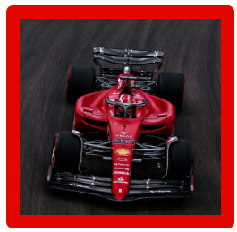
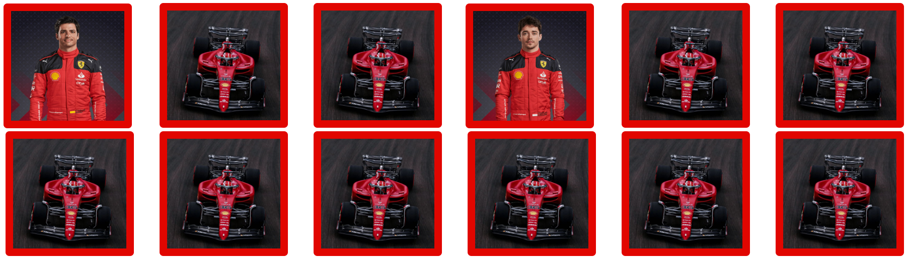

# F1 - Pole Position! 
Welcome to F1 - Pole Position! It is a Memory Card Game for fans of Formula 1 or fans of online games. Uncover the matching pairs of F1 teammates. The fastest you match them and the higher chances you will have to start in pole ahead of everyone and of Super Max - alias Max Verstappen. 

In Formula1 racing and other motorsport races, the pole position is usually the best and "statistically the most advantageous" starting position on the track. The driver starting on pole is the one that qualifies with the fastest lap on the day before the race.

The link to our Live Website can be found here - [F1 - Pole Position!](https://aedoardo1990.github.io/F1_PolePosition/).

## Index - Table of Contents
<!--Toc-->

- [F1 - Pole Position!](#f1---pole-position)
  - [Index - Table of Contents](#index---table-of-contents)
  - [User experience](#user-experience)
    - [Target audience](#target-audience)
  - [User stories](#user-stories)
    - [As a site visitor I want to:](#as-a-site-visitor-i-want-to)
    - [As a site administrator I want to:](#as-a-site-administrator-i-want-to)
  - [Design](#design)
    - [Color scheme](#color-scheme)
    - [Typography](#typography)
    - [Wireframes](#wireframes)
  - [Features](#features)
    - [Modal to start the game](#modal-to-start-the-game)
    - [The logo and the header](#the-logo-and-the-header)
    - [Game rules](#game-rules)
      - [Super Max](#super-max)
      - [Formula1 pilots and teams](#formula1-pilots-and-teams)
    - [The Official F1 Anthem](#the-official-f1-anthem)
    - [The score area](#the-score-area)
    - [Back image of the cards](#back-image-of-the-cards)
    - [Game area](#game-area)
    - [End of Game Message](#end-of-game-message)
    - [Soundtrack for the winner](#soundtrack-for-the-winner)
    - [Drive again button](#drive-again-button)
    - [Footer](#footer)
  - [Features left to implement](#features-left-to-implement)
    - [Circuit option](#circuit-option)
    - [Car option](#car-option)
    - [Different levels of difficulty](#different-levels-of-difficulty)
    - [All the F1 pilots cards](#all-the-f1-pilots-cards)
    - [F1 Ceremony for the winner](#f1-ceremony-for-the-winner)
  - [Testing](#testing)
    - [HTML-W3C-Validator](#html-w3c-validator)
    - [CSS-Validator](#css-validator)
    - [JSHint-Validator](#jshint-validator)
    - [Lighthouse testing](#lighthouse-testing)
    - [Form testing](#form-testing)
    - [Browser testing](#browser-testing)
    - [Device testing](#device-testing)
    - [Mentor, family and friends testing](#mentor-family-and-friends-testing)
    - [Fixed bugs](#fixed-bugs)
      - [Pilots images not loading on Edge Browser](#pilots-images-not-loading-on-edge-browser)
    - [Unfixed bugs](#unfixed-bugs)
  - [Technologies used](#technologies-used)
    - [Languages](#languages)
    - [Programs used](#programs-used)
  - [Deployment](#deployment)
  - [Credits](#credits)
    - [Media](#media)
    - [Code used](#code-used)
  - [Acknowledgements](#acknowledgements)

<!--Toc stop-->

---

## User experience

### Target audience

The F1 - Pole Position! Website targets an audience of people interested in racing car online games - especially fans of Formula 1 - and in general at reaching people interested in sport online games as a hobby. 

## User stories

### As a site visitor I want to: 

- read a quick and clear explanation of the game and start playing immediately. 
- know more information about the Formula 1 pilots and its teams.
- know who is Super Max. 
- be able to enter my driver/player name, my photo and to have them displayed in the site. 
- access a website that it is easy to navigate and with some interactive features. 
- want to hear the Formula 1 anthem to charge myself for the game. 
- a site where I can play with the cards of the pilots of Formula1.
- feel the atmosphere of Formula1 races through a website with captivating design.  
- have a game based on time speed. 
- know my final position at the end of the game. 
- get a congratulation message if I ll finish on podium. 
- get a congratulation message with music if I ll finish first. 
- have the option to play again after the end of the game.
- keep updated about new features of the site by accessing the social media links. 

### As a site administrator I want to:

- introduce future features to the website. 
- offer the user with an interactive experience. 
- attract more fans to Formula1.
  
## Design

### Color scheme

The color chosen for the website are red, white and black. These colors are mainly the same of the official website of <a href="https://www.Formula1.com" target="_blank" rel="noopener" aria-label="Visit the official Formula1 Website (opens in a new tab)">Formula1</a>. Purpose of these colors is to recreate the feeling of Formula1 racing

On the top of them, gold metallic, silver and bronze are used for the pop up messages at the end of the game according to the position of the player. They want to remind of the colors of the medals used to award in sport competitions.  
If the player does not finish on podium, the color of the message will be in brown. That is because in sport the "award" a sportsman gets for 4th place is known as the "wooden medal".

### Typography

The Font chosen for the text on all the pages is "Titillium Web". This is the same Font of the just mentioned website of Formula1. This Font wants as well to convey the player with the atmoshere of Formula1 racing. 

### Wireframes
TO DO 

## Features

The website includes all the necessary features of a functioning and interactive memory card game website. 

### Modal to start the game 

The modal pops up when the site loads. It allows to enter the player name and to upload a player photo. Photo and player name will be then transferred to the black score area box. 
When the button "Start the Qualifying" is pressed, the game starts. The player is not obliged to enter a name and upload a photo. The game will run anyway by presing the button. 

### The logo and the header 

The logo at the top left corner of the website is the official logo of Formula1. The header wants to remind the header of the official site of Formula1. 

### Game rules

In this section there is a brief description of the game rules. 

#### Super Max 

When clicking on Super Max the user is redirected to the Wikipedia page of Max Verstappen, the current F1 World Champion. 
If you are curios to know more about the origin of his nick name, click <a href="https://en.wikipedia.org/wiki/Super_Max!" target="_blank" rel="noopener" aria-label="Visit the Wikipedia page of Super Max (opens in a new tab)">here</a>.

#### Formula1 pilots and teams 

For the user that don't know much about Formula1, they can get all the in-depth information about F1 drivers and its teams by clicking on "Formula1". They will be redirected to the official page of Formula1. 

### The Official F1 Anthem 

This audio toggle allows to listen to a part of the official anthem of Formula 1 before playing. This is a function to recreate the feeling of Formula1 racing for F1 fans. 
If you want to listen to the full anthem, please click <a href="https://www.youtube.com/watch?v=8AYy-BcjRXg" target="_blank" rel="noopener" aria-label="Check the Youtube video of the Official F1 Anthem (opens in a new tab)">here</a>.

1- Play button 

2- Stop button

### The score area 

In the score area you have information about theplayer's name, time of the race, final position and there is the photo of Max Verstappen in a Card Format. 

When the button "Start the Qualifying" is pressed, 3 things happen:
 - the timer in the score area box starts 
 - the driver photo of Verstappen will be replaced with the one of the player
 - the driver namre is entered

When the game ends, the "Position:" line will be updated with the final position of the player. There are 4 positions: 1st, 2nd, 3rd, and Out of Podium. 

The design of the score area aims at reminding the design of the official qualifying table of Formula1. Here below an example. 

### Back image of the cards

The back image of the cards is the Ferrari of the driver Charles Leclerc. Ferrari is the iconic team of Formula1 and it is the only team which has participated to all the F1 championships since the first Formula1 season of 1950. 

### Game area 

This is the main feature of the site. It consists of 12 cards (6 pairs), which appear face down at the start of the game. When clicked, cards turn face up. Matching pairs remain face up. Non-matching cards flip back with face down.

### End of Game Message 

At the end of the game, the timer will stop and the final position will be entered in the score area. 
Then a window will pop up and display the final position with the matching color( Gold for 1st, Silver for 2nd, Bronze for 3rd, Brown for Out of Podium/Fourth). Just for the winner getting the Pole Position, an audio theme will start when the end game window will pop up as below. 

### Soundtrack for the winner

The soundtrack - "Les Toreadors" of Georges Bizet -  is the theme that you can hear at the end of a F1 Grand Prix when the winners ceremony with champagne takes place. Click <a href="https://www.youtube.com/watch?v=SpL9iaFM0C4" target="_blank" rel="noopener" aria-label="Check the Youtube video of the F1 Podium Ceremony (opens in a new tab)">here</a> to check a F1 Podium ceremony. 
The Sountrack aims at recreating the atmosphere of F1. 

### Drive again button

When the end of game window pops up, there is a button that will allow to play again. This happens via reload of the site. 

### Footer 

The footer contains the links to our social media pages to keep updated with all the news concerning our website. 

## Features left to implement

### Circuit option      

Option to choose from the Start Modal on which circuit of the F1 World Championship to drive. 

### Car option  

Option to choose from the Start Modal for which team/car of the F1 World Championship to qualify. 

### Different levels of difficulty

The positioning at the end of the race already represents a different level of difficulty according to the position. However, in the future it would be nice to add different levels of difficulty to choose from in the Modal that loads at the start. Levels of difficulty would be divided accordingly: Beginner, Intermediate, Pro. 

### All the F1 pilots cards 

F1 World Championship has 10 teams and 20 pilots (2 pilots per team). The game includes its most prestigious ones, for a total of 6 teams and 12 pilots. For reasons of space (especially for the mobile version) I preferred to opt for a reduction of the amount of pilots. 
It would be nice to include all the teams and pilots. This should go together most likely with using Flexbox Grid, in order to optimize the screen space. 

### F1 Ceremony for the winner 

Including a video of the typical podium F1 ceremony based on champagne that would be part of the pop up window for the winner. 

## Testing

### HTML-W3C-Validator

The result of the W3C Validator is all correct, no errors.

### CSS-Validator

No errors after checking the code with W3C Jigsaw CSS Validator. There is just one warning visible in the screenshot below at the bottom. This is due to the imported Google fonts.

### JSHint-Validator

TO DO 

### Lighthouse testing

Here below the score resulting from Lighthouse testing for the Website.

### Form testing

The modal form has been tested so that the game can be played without having to enter a driver name and upload a driver photo

### Browser testing 

The Website was tested on Google Chrome, Microsoft Edge, Safari, and Firefox with no issues.

### Device testing

The Website was tested on the following devices, OnePlusNord10, iPhone13 mini, MacBook, laptop Acer Swift SF314-43 and created for the following screen sizes: 320px, 576px, 768px, 992px, 1240px, 1440px, 2560px and up.

### Mentor, family and friends testing

My mentor, my family and friends checked the site and helped to identify bugs and get a feeling about how the user-experience is perceived by visitors of the site.

### Fixed bugs

#### Pilots images not loading on Edge Browser

The images of the pilots on the front of the cards were not loading just on Microsoft Edge. They were in format ".avi". I converted them to ".jpg" and this solved the issue. 

### Unfixed bugs

The sample image in the Score Area with Max Verstappen and the helmet is often not displayed when the website loads. There are instead never issues regarding the player photo that is uploaded in the same box. 

## Technologies used

### Languages

- HTML
- CSS
- JavaScript

### Programs used
- [Chrome Dev Tools](https://developer.chrome.com/docs/devtools/) - for testing responsivness, development of the website and lighthouse testing
- [Google Fonts](https://fonts.google.com/) - to import fonts to the website
- [Font Awesome](https://fontawesome.com/) - for social media icons in footer and for the icon of the dropdown menu
- [W3C](https://www.w3.org/) - for HTML & CSS Validation.
- [JShint](https://jshint.com/) - for JavaScript Validation.

## Deployment

The project was deployed using GitHub pages. The steps to deploy using GitHub pages are:

1. Go to the repository on GitHub.com
2. Select 'Settings' near the top of the page.
3. Select 'Pages' from the menu bar on the left of the page.
4. Under 'Source' select the 'Branch' dropdown menu and select the main branch.
5. Once selected, click the 'Save'.
6. Deployment should be confirmed by a message on a green background saying "Your site is published at" followed by the web address.

The link of the deployed site can be found here - [F1 - Pole Position!](https://aedoardo1990.github.io/F1_PolePosition/)

## Credits

### Media 

- [Formula 1 Official](https://www.formula1.com/) - photos of the pilots and the F1 logo at the top left corner of the website
- [Pinterest](https://www.pinterest.it/) -  photo of the Ferrari on the back of the cards and photo of Max Verstappen in the Score area
- [Red Ringtones](https://www.redringtones.com/) - soundtrack of the winner "Les toreadors" of Georges Bizet 
- [Zedge](https://www.zedge.net/ringtones-and-wallpapers) - F1 Anthem 

### Code used

- Inspiration for the memory card game - [Memory Card Game of Kathrin Ddggxh](https://github.com/Kathrin-ddggxh/CI-PP2_memory-card-game/tree/main)
- Inspiration for the design of the website - [Offical Formula1 Website](https://www.formula1.com/en.html)
- Transmitting player photo from form to div with class="card-driver" in HTML - line 9 of script.js file - [Stack overflow](https://stackoverflow.com/)
- Creation of timer - line 22 of script.js file - [Stack overflow](https://stackoverflow.com/)
- Toggle Play to switch on/off the F1 anthem - line 53 of script.js file - [Stack overflow](https://stackoverflow.com/)
- Cards area - line 68 of script.js file - [Github of Marina Ferreira](https://marina-ferreira.github.io/tutorials/js/memory-game/)

For more details on the code used in js, please check the scrupt.js file. 

## Acknowledgements

My mentor Antonio for his great support and the professional practical advices.

My wife for her great interest and passion for my work.

Kay of Code Institute and the Slack Community. 

  

